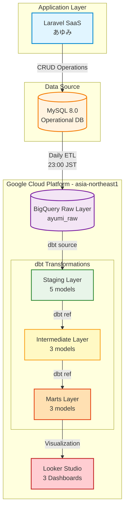

# あゆみSaaS データ分析基盤 - システムアーキテクチャ

作成日: 2025年11月6日  
バージョン: 1.0  
ステータス: Phase 1-3 完了

---

## 📐 システム全体構成

### アーキテクチャ図



---

## 🔄 データフロー詳細

### Phase 0: Application Layer
**Laravel SaaS → MySQL**

| 要素 | 説明 |
|------|------|
| **アプリケーション** | Laravel 10.x + PHP 8.2 |
| **データベース** | MySQL 8.0 |
| **主要機能** | 出席管理、日報入力、面談記録、支援計画 |
| **ユーザー** | 利用者(25名) + スタッフ(5名) |
| **トランザクション** | CRUD操作、承認ワークフロー |

**データ特性**:
- リアルタイム性が必要
- トランザクション整合性が重要
- 個人情報を含む機微データ

---

### Phase 1: Data Ingestion
**MySQL → BigQuery Raw Layer**

| 項目 | 詳細 |
|------|------|
| **実行頻度** | Daily (23:00 JST) |
| **転送方法** | CSV Export → BigQuery Load |
| **データセット** | `ayumi_raw` |
| **ロケーション** | `asia-northeast1` (Tokyo) |
| **対象テーブル** | 5テーブル |

**転送テーブル**:
1. `raw_users` (25行)
2. `raw_staffs` (5行)
3. `raw_attendance_records` (1,650行)
4. `raw_daily_reports_morning` (1,449行)
5. `raw_daily_reports_evening` (1,449行)

**ETLプロセス**:
```sql
-- 例: MySQLからのエクスポート
SELECT * FROM users WHERE deleted_at IS NULL
INTO OUTFILE '/tmp/users.csv'
FIELDS TERMINATED BY ','
ENCLOSED BY '"'
LINES TERMINATED BY '\n';
```

**今後の改善計画**:
- Cloud Composer (Airflow) による自動化
- Cloud Functions によるトリガー実行
- リアルタイム化 (CDC + Pub/Sub)

---

### Phase 2: Staging Layer (dbt)
**データクリーニング・標準化**

#### 目的
- Rawデータを分析可能な形に整形
- カラム名の標準化
- データ型の統一
- 論理削除レコードの除外

#### 実装モデル (5モデル)

| Model | Description | Rows | Materialization | 処理内容 |
|-------|-------------|------|-----------------|----------|
| `stg_users` | 利用者マスタ | 25 | view | 個人情報マスク、年齢計算 |
| `stg_staffs` | スタッフマスタ | 5 | view | カラム名標準化 |
| `stg_attendance_records` | 出席記録 | 1,650 | view | 日付正規化、承認フラグ追加 |
| `stg_daily_reports_morning` | 朝日報 | 1,449 | view | タイムゾーン調整 |
| `stg_daily_reports_evening` | 夕日報 | 1,449 | view | タイムゾーン調整 |

#### サンプルコード

```sql
-- models/staging/stg_users.sql
WITH source AS (
    SELECT * FROM {{ source('ayumi', 'raw_users') }}
)

SELECT
    id AS user_id,
    nickname,  -- 実名は使わない
    EXTRACT(YEAR FROM CURRENT_DATE) - EXTRACT(YEAR FROM birth_date) AS age,
    gender,
    DATE(registered_at, 'Asia/Tokyo') AS registered_date,
    is_active
FROM source
WHERE deleted_at IS NULL
```

#### データ品質テスト

```yaml
# models/staging/_staging.yml
models:
  - name: stg_users
    columns:
      - name: user_id
        tests:
          - unique
          - not_null
      - name: age
        tests:
          - dbt_utils.accepted_range:
              min_value: 18
              max_value: 100
```

---

### Phase 3: Intermediate Layer (dbt)
**ビジネスロジック適用**

#### 目的
- 複数テーブルの結合
- ビジネスルールの適用
- 集計・計算処理

#### 実装モデル (3モデル)

| Model | Description | Materialization | 処理内容 |
|-------|-------------|-----------------|----------|
| `int_user_monthly_attendance` | 月次出席集計 | table | 出席率・遅刻率計算 |
| `int_user_relationships` | 利用者-担当者関係 | table | スタッフ関係マッピング |
| `int_daily_health_metrics` | 日次健康指標 | table | 睡眠・ストレス週次集計 |

#### サンプルコード

```sql
-- models/intermediate/int_user_monthly_attendance.sql
WITH attendance AS (
    SELECT * FROM {{ ref('stg_attendance_records') }}
)

SELECT
    user_id,
    DATE_TRUNC(attendance_date, MONTH) AS month,
    COUNT(*) AS total_days,
    COUNTIF(status = 'present') AS present_days,
    COUNTIF(status = 'absent') AS absent_days,
    COUNTIF(status = 'late') AS late_days,
    ROUND(COUNTIF(status = 'present') / COUNT(*) * 100, 2) AS attendance_rate,
    ROUND(COUNTIF(status = 'late') / COUNT(*) * 100, 2) AS late_rate
FROM attendance
GROUP BY user_id, month
```

#### ビジネスロジック

**出席率の計算**:
```
出席率 = (出席日数 / 総日数) × 100
```

**出席カテゴリ分類**:
- 優良: 90%以上
- 良好: 70-89%
- 要注意: 50-69%
- 要支援: 50%未満

---

### Phase 4: Marts Layer (dbt)
**分析用最終テーブル**

#### 目的
- ダッシュボード用のデータマート作成
- ユースケース別に最適化
- パフォーマンス向上

#### 実装モデル (3モデル)

| Model | Description | Target | Materialization |
|-------|-------------|--------|-----------------|
| `mart_user_attendance_summary` | 出席サマリー | 経営管理 | table |
| `mart_staff_support_metrics` | スタッフ支援指標 | 支援状況 | table |
| `mart_program_effectiveness` | プログラム効果測定 | 個人レポート | table |

#### KPI定義

**1. 出席管理KPI**
```sql
-- 要支援フラグの判定
CASE
    WHEN attendance_rate >= 90 THEN '優良'
    WHEN attendance_rate >= 70 THEN '良好'
    WHEN attendance_rate >= 50 THEN '要注意'
    ELSE '要支援'
END AS attendance_category,

-- 連続欠席フラグ (3日以上で要支援)
absent_days >= 3 AS needs_support_flag
```

**2. メンタルヘルスKPI**
```sql
-- ストレス上昇トレンド検出
LAG(avg_stress_level, 1) OVER (PARTITION BY user_id ORDER BY week) AS prev_week_stress,
LAG(avg_stress_level, 2) OVER (PARTITION BY user_id ORDER BY week) AS prev_2week_stress,

CASE
    WHEN avg_stress_level > prev_week_stress 
     AND prev_week_stress > prev_2week_stress
    THEN TRUE
    ELSE FALSE
END AS stress_increasing_flag
```

**3. 訓練効果KPI**
```sql
-- 月次訓練時間目標達成
CASE
    WHEN total_training_hours >= 60 THEN '達成'
    WHEN total_training_hours >= 45 THEN '概ね達成'
    ELSE '未達成'
END AS training_goal_status
```

---

### Phase 5: Visualization
**Looker Studio - 3 Dashboards**

#### ダッシュボード1: 経営管理ダッシュボード
**対象**: 施設長・管理者

**データソース**: `mart_user_attendance_summary`

**主要指標**:
- 総利用者数 (スコアカード)
- 稼働率 (スコアカード)
- 月次平均出席率 (スコアカード)
- 要支援者数 (スコアカード)

**グラフ**:
- 月次出席率推移 (折れ線グラフ)
- 利用者カテゴリ分布 (円グラフ)
- 稼働率推移 (棒グラフ)

**フィルター**:
- 期間選択 (月次)
- 出席カテゴリ

---

#### ダッシュボード2: 支援状況ダッシュボード
**対象**: スタッフ

**データソース**: `mart_staff_support_metrics`

**主要コンポーネント**:
- 要支援者リスト (テーブル)
  - 利用者名
  - 出席率
  - 連続欠席日数
  - ストレスレベル
  - 要支援フラグ

**グラフ**:
- メンタルヘルストレンド (折れ線グラフ)
- 睡眠時間分布 (ヒストグラム)
- ストレスレベル分布 (ヒートマップ)

**フィルター**:
- 期間選択 (週次/月次)
- 出席カテゴリ
- ストレスレベル範囲
- 担当スタッフ

---

#### ダッシュボード3: 個人レポート
**対象**: 利用者本人

**データソース**: `mart_program_effectiveness`

**主要指標**:
- 今月の出席率 (スコアカード)
- 今月の訓練時間 (スコアカード)
- 平均自己評価 (スコアカード)

**グラフ**:
- 訓練時間推移 (折れ線グラフ)
- 自己評価推移 (折れ線グラフ)
- 出席状況カレンダー (ヒートマップ)

**フィルター**:
- 期間選択 (月次)

---

## ✅ データ品質管理

### dbt Tests概要

| テストタイプ | 数量 | 説明 |
|------------|------|------|
| unique | 8 | Primary Keyの一意性 |
| not_null | 11 | 必須カラムのNULLチェック |
| relationships | 6 | 外部キー整合性 |
| accepted_values | 2 | 値の妥当性 |
| custom | 2 | ビジネスロジック検証 |
| **合計** | **29** | **全てPASS ✅** |

### テストカバレッジ

**Staging Layer**:
```yaml
# Unique + Not Null (Primary Keys)
- stg_users.user_id
- stg_staffs.staff_id
- stg_attendance_records.attendance_id
- stg_daily_reports_morning.report_id
- stg_daily_reports_evening.report_id

# Relationships (Foreign Keys)
- stg_attendance_records.user_id → stg_users.user_id
- stg_daily_reports_morning.user_id → stg_users.user_id
- stg_daily_reports_evening.user_id → stg_users.user_id
```

**Intermediate Layer**:
```yaml
# Unique Combinations
- int_user_monthly_attendance: [user_id, month]

# Value Ranges
- int_user_monthly_attendance.attendance_rate: 0-100
- int_user_monthly_attendance.late_rate: 0-100
```

**Marts Layer**:
```yaml
# Business Logic Validation
- mart_user_attendance_summary.needs_support_flag: boolean
- mart_staff_support_metrics.stress_increasing_flag: boolean

# Referential Integrity
- All mart tables link back to stg_users
```

### テスト実行結果

```bash
$ dbt test

Running with dbt=1.7.0
Found 11 models, 29 tests, 0 snapshots, 0 analyses, 0 macros

Completed successfully

Done. PASS=29 WARN=0 ERROR=0 SKIP=0 TOTAL=29
```

---

## 🔐 セキュリティ・コンプライアンス

### 個人情報保護

**実装内容**:
- ✅ 実名データの非表示 (ニックネーム使用)
- ✅ 生年月日 → 年齢への変換
- ✅ 個人を特定できる情報の除外
- ✅ 論理削除でデータを保持

**Staging層での処理**:
```sql
-- 個人情報のマスキング
SELECT
    id AS user_id,
    nickname,  -- 実名は含まない
    EXTRACT(YEAR FROM CURRENT_DATE) - EXTRACT(YEAR FROM birth_date) AS age,  -- 生年月日→年齢
    gender,
    -- 住所などの詳細情報は除外
FROM source
WHERE deleted_at IS NULL  -- 論理削除
```

### データガバナンス

| 項目 | 実装内容 |
|------|----------|
| **データロケーション** | `asia-northeast1` (東京) - 国内データ保存 |
| **アクセス制御** | サービスアカウント経由のみ (IAM管理) |
| **権限管理** | BigQuery Admin、Data Editor、Job User |
| **監査ログ** | BigQueryのクエリログで全操作を記録 |
| **データ保持期間** | 論理削除で管理、物理削除は90日後 |

### コンプライアンス対応

**GDPR準拠**:
- ✅ データ削除権 (ソフトデリート実装)
- ✅ データポータビリティ (CSV出力機能)
- ✅ 透明性 (データ処理の文書化)
- ✅ 最小限のデータ収集

**個人情報保護法準拠**:
- ✅ 利用目的の明示
- ✅ 安全管理措置 (暗号化・アクセス制御)
- ✅ 第三者提供の制限
- ✅ 開示請求への対応

---

## 📈 パフォーマンス最適化

### 現状のパフォーマンス

| 指標 | 値 |
|------|-----|
| データ量 | ~5,000レコード |
| dbt run時間 | <3分 |
| クエリレスポンス | <2秒 |
| BigQueryコスト | 無料枠内 (~$0) |

### 最適化手法

**1. Materialization戦略**
```yaml
# Staging: View (軽量・リアルタイム)
stg_users:
  materialized: view

# Intermediate: Table (バランス)
int_user_monthly_attendance:
  materialized: table

# Marts: Table (パフォーマンス優先)
mart_user_attendance_summary:
  materialized: table
```

**2. パーティショニング (今後の拡張)**
```sql
-- 日付でパーティション分割
CREATE TABLE mart_user_attendance_summary
PARTITION BY month
AS SELECT ...
```

**3. クラスタリング (今後の拡張)**
```sql
-- よく使うフィルタでクラスタ化
CREATE TABLE mart_user_attendance_summary
CLUSTER BY user_id, month
AS SELECT ...
```

---

## 🚀 スケーラビリティ

### 現状
- データ量: ~1,000レコード/月
- 利用者数: 25名
- 処理時間: <5分
- コスト: 無料枠内

### 拡張シナリオ

#### シナリオ1: 利用者10倍 (250名)
- データ量: ~10,000レコード/月
- 処理時間予測: <10分
- コスト予測: ~$5/月
- 対応: 現行アーキテクチャで対応可能

#### シナリオ2: 全国展開 (10事業所、2,500名)
- データ量: ~100,000レコード/月
- 処理時間予測: <30分
- コスト予測: ~$50/月
- 対応: パーティショニング + クラスタリング必須

#### シナリオ3: リアルタイム化
**現状**: Daily batch (23:00)
**目標**: Near real-time (5分遅延)

**実装案**:
```
Laravel → Cloud Functions → Pub/Sub → BigQuery Streaming Insert → dbt Incremental Models
```

**技術スタック追加**:
- Cloud Functions (トリガー)
- Cloud Pub/Sub (メッセージング)
- BigQuery Streaming (リアルタイム挿入)
- dbt Incremental Models (差分更新)

---

## 🔄 運用・保守

### 日次運用フロー

```
23:00 JST: MySQL → CSV Export
23:15 JST: CSV → BigQuery Load
23:30 JST: dbt run (全モデル実行)
23:45 JST: dbt test (データ品質テスト)
00:00 JST: Looker Studio 自動更新
```

### モニタリング項目

| 項目 | しきい値 | アラート |
|------|---------|----------|
| dbt run 失敗 | 1回 | Slack通知 |
| dbt test 失敗 | 1回 | Slack通知 |
| データ遅延 | 2時間以上 | Email通知 |
| BigQueryコスト | $50/月超過 | Email通知 |

### バックアップ戦略

- **BigQuery**: 自動バックアップ (7日間保持)
- **dbtコード**: GitHub (バージョン管理)
- **Looker Studio**: 定期的なスナップショット取得

---

## 📚 技術的な学び

### 実装を通じて習得したスキル

1. **dbt開発**
   - Sourcesとrefsの使い分け
   - Materialization戦略
   - データ品質テスト設計

2. **BigQuery活用**
   - データセット・テーブル管理
   - ロケーション設定の重要性
   - IAM権限管理

3. **データモデリング**
   - 3層アーキテクチャ (Staging/Intermediate/Marts)
   - ビジネスロジックの分離
   - パフォーマンスとメンテナンス性のバランス

4. **BI開発**
   - Looker Studio設計
   - ユーザー別ダッシュボード最適化
   - フィルタ・インタラクティブ機能

---

## 🎯 今後の改善計画

### Phase 4: 自動化 (予定)
- [ ] Cloud Composer (Airflow) 導入
- [ ] ETL自動実行
- [ ] アラート機能実装

### Phase 5: ML活用 (予定)
- [ ] 退所リスク予測モデル
- [ ] 就職マッチング推薦
- [ ] 異常検知 (メンタルヘルス)

### Phase 6: リアルタイム化 (予定)
- [ ] CDC (Change Data Capture) 実装
- [ ] Streaming Pipeline構築
- [ ] Incremental Models実装

---

## 📞 お問い合わせ

技術的な質問や改善提案は、GitHubのIssueまたはPull Requestでお願いします。

---

**最終更新**: 2025年11月6日  
**バージョン**: 1.0  
**ステータス**: Phase 1-3 完了 ✅