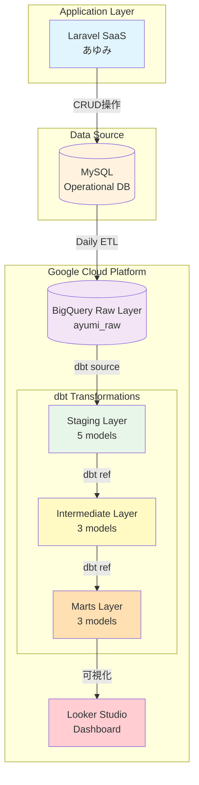

<!-- architecture.md -->
# あゆみSaaS データ分析基盤 アーキテクチャ

## 📐 システム全体構成

## 📊 データフロー詳細

### Phase 1: Data Ingestion
- **Source**: Laravel SaaS (MySQL)
- **Target**: BigQuery Raw Layer
- **Frequency**: Daily (23:00 JST)
- **Method**: Manual CSV upload → 今後自動化予定

### Phase 2: Staging Layer (dbt)
**目的**: データクリーニング・標準化

| Model | Description | Materialization |
|-------|-------------|-----------------|
| stg_users | 利用者マスタ | view |
| stg_staffs | スタッフマスタ | view |
| stg_attendance_records | 出席記録 | view |
| stg_daily_reports_morning | 朝日報 | view |
| stg_daily_reports_evening | 夕日報 | view |

### Phase 3: Intermediate Layer (dbt)
**目的**: ビジネスロジック適用

| Model | Description | Materialization |
|-------|-------------|-----------------|
| int_user_monthly_attendance | 月次出席集計 | table |
| int_user_relationships | 利用者-担当者関係 | table |
| int_daily_health_metrics | 日次健康指標 | table |

### Phase 4: Marts Layer (dbt)
**目的**: 分析用最終テーブル

| Model | Description | Materialization |
|-------|-------------|-----------------|
| mart_user_attendance_summary | 出席サマリー | table |
| mart_staff_support_metrics | スタッフ支援指標 | table |
| mart_program_effectiveness | プログラム効果測定 | table |

### Phase 5: Visualization
- **Tool**: Looker Studio
- **Dashboards**: 3ページ構成
  - 出席状況ダッシュボード
  - メンタルヘルスモニタリング
  - プログラム効果分析

## ✅ データ品質管理

### dbt Tests
- **合計**: 29 tests
- **Status**: All PASS ✅
- **Coverage**:
  - Primary Key uniqueness
  - Not Null constraints
  - Referential integrity
  - Business logic validation

## 🔐 セキュリティ・コンプライアンス

- 個人を特定できる実名データは非表示
- BigQueryロケーション: asia-northeast1 (東京)
- データアクセス権限: サービスアカウント経由のみ